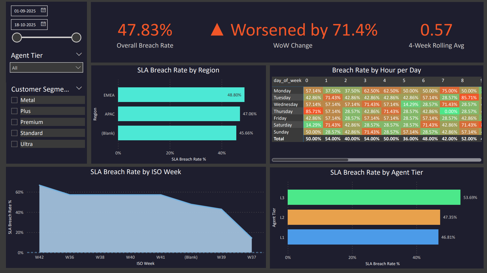
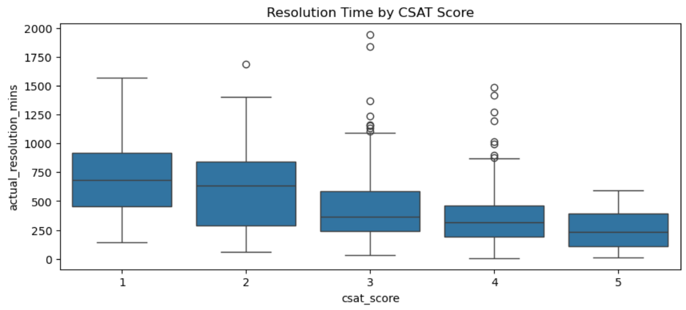
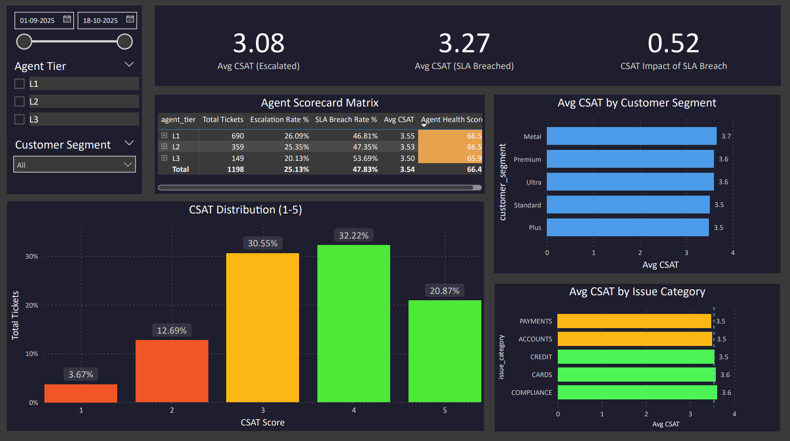
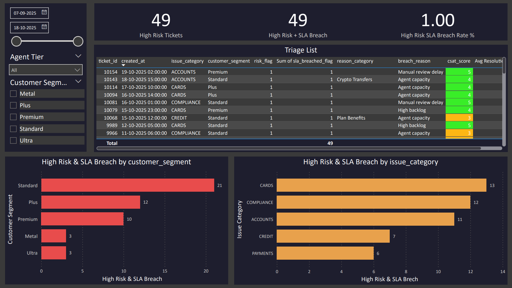
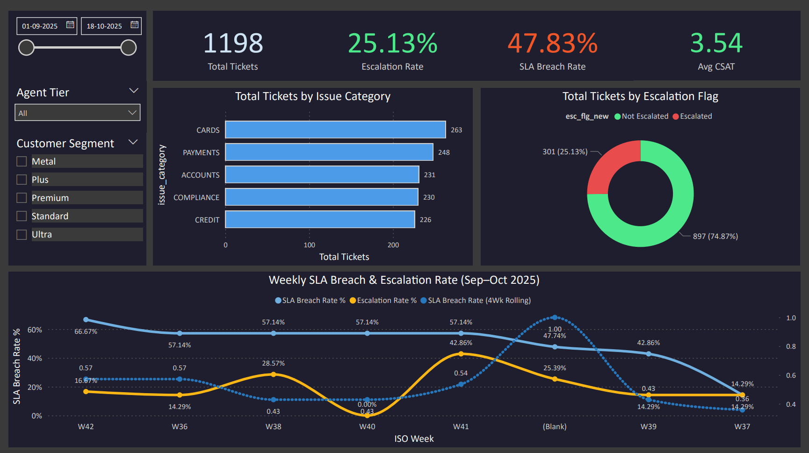

# 🎯 Escalation, SLA & CSAT Deep-Dive Analysis

> **Notebook:** `Escalation_SLA_CSAT_Analysis.ipynb`  
> **Database:** `opsSLA.db` (SQLite)  
> **Input table:** `tickets_esc_summary` (1,200 enriched records)  
> **Analysis period:** September 2025 – October 2025

This notebook performs a **targeted deep-dive** into the key operational metrics of a FinTech support environment — escalation rates, SLA compliance, CSAT scores, agent performance, and repeat contact behaviour. The goal is to translate raw support data into **evidence-based recommendations** for process and staffing improvements.

---

## 🎯 Objectives

- Identify the **top escalation reasons** and which issue categories drive them most
- Analyse **SLA breach patterns** by agent tier, region, and breach reason
- Understand **CSAT score distribution** and its relationship to escalation and SLA outcomes
- Benchmark **agent performance** across tiers (L1, L2, L3) and regions (EMEA, APAC)
- Investigate **repeat contact behaviour** by customer segment and risk profile
- Perform **statistical hypothesis testing** to validate observed differences
- Deliver **actionable process recommendations** backed by data

---

## 📂 Input Data

All analysis is performed on the `tickets_esc_summary` table — the enriched master view created during the EDA phase:

| Column Group | Key Fields |
|---|---|
| **Ticket** | `ticket_id`, `created_at`, `resolution_time_mins`, `resolution_time_hours` |
| **Issue** | `issue_category`, `escalation_flag`, `escalation_reason_id`, `reason_category` |
| **Customer** | `customer_id`, `customer_segment`, `tenure_months`, `risk_flag` |
| **Agent** | `agent_id`, `agent_tier`, `region`, `experience_months` |
| **SLA** | `sla_target_mins`, `sla_breached_flag`, `breach_reason`, `sla_risk_flag` |
| **Outcome** | `csat_score`, `repeat_contact_flag`, `severity_score`, `resolution_speed` |
| **Payment** | `payment_type`, `country` |
| **Temporal** | `created_date`, `created_week`, `created_month`, `created_hour`, `created_dow` |

---

## 📊 Analysis Sections

---

### 1. Escalation Analysis

**Research Question:** Which issue categories, payment types, customer segments, and agent tiers drive escalation the most?

```python
import plotly.graph_objects as go

# Escalation rate by issue category
esc_by_cat = tickets_enriched.groupby('issue_category').agg(
    total=('escalation_flag','count'),
    escalations=('escalation_flag','sum')
).reset_index()
esc_by_cat['esc_rate'] = esc_by_cat['escalations'] / esc_by_cat['total']
esc_by_cat = esc_by_cat.sort_values('esc_rate')

fig = go.Figure(go.Bar(
    x=esc_by_cat['esc_rate'], y=esc_by_cat['issue_category'],
    orientation='h',
    marker_color='#4C9BE8',
    text=[f"{r:.1%}" for r in esc_by_cat['esc_rate']],
    textposition='outside'
))
fig.update_xaxes(title_text='Escalation Rate', tickformat='.0%')
fig.update_yaxes(title_text='Issue Category')
fig.show()
```

**Top escalation reasons** (from 15 reason categories):
- Chargeback — Dispute raised for an unauthorized / incorrect transaction
- Plan Benefits — Paid plan benefits not applied or incorrectly processed
- Insurance — Delay or rejection in insurance claim processing
- Shops — Cashback or merchant shop rewards missing
- RevPoints — Incorrect RevPoints balance or redemption issue


---

### 2. SLA Breach Analysis

**Research Question:** Which agent tier, region, and time patterns show the highest SLA breach concentration? What are the root-cause breach reasons?

```python
import plotly.graph_objects as go
from plotly.subplots import make_subplots

# SLA breach rate by agent tier
tier_sla = tickets_enriched.groupby('agent_tier').agg(
    sla_breach_rate=('sla_breached_flag','mean')
).reset_index()

fig = make_subplots(rows=1, cols=2,
    subplot_titles=['SLA Breach Rate by Tier', 'Breach Reason Breakdown'])

fig.add_trace(go.Bar(
    x=tier_sla['agent_tier'], y=tier_sla['sla_breach_rate'],
    marker_color=['#4C9BE8','#E8A14C','#4CE88A'],
    text=[f"{r:.1%}" for r in tier_sla['sla_breach_rate']],
    textposition='outside'
), row=1, col=1)

breach_reasons = tickets_enriched['breach_reason'].value_counts().reset_index()
breach_reasons.columns = ['reason','count']
fig.add_trace(go.Bar(
    x=breach_reasons['reason'], y=breach_reasons['count'],
    marker_color='#9B4CE8'
), row=1, col=2)

fig.update_yaxes(title_text='Breach Rate', tickformat='.0%', row=1, col=1)
fig.update_yaxes(title_text='Count', row=1, col=2)
fig.show()
```

**SLA targets by severity:**
- Escalated / high-severity tickets: **360 minutes (6 hours)**
- Standard tickets: **240 minutes (4 hours)**

**Breach reasons investigated:**
- `High backlog` — volume surge overwhelmed available capacity
- `Agent capacity` — insufficient agents available at time of assignment
- `None` — resolved within SLA target



---

### 3. CSAT Score Analysis

**Research Question:** Does escalation or SLA breach measurably lower CSAT? Which issue categories and customer segments score worst? Is the relationship between resolution time and CSAT statistically significant?

```python
import plotly.graph_objects as go
from scipy.stats import ttest_ind, spearmanr

# CSAT distribution
csat_dist = tickets_enriched['csat_score'].value_counts().sort_index().reset_index()
csat_dist.columns = ['score', 'count']
csat_colors = {1:'#E84C4C', 2:'#E8A14C', 3:'#E8E04C', 4:'#4CE8D5', 5:'#4CE88A'}

fig = go.Figure(go.Bar(
    x=csat_dist['score'], y=csat_dist['count'],
    marker_color=[csat_colors[s] for s in csat_dist['score']],
    text=[f"{c/csat_dist['count'].sum():.1%}" for c in csat_dist['count']],
    textposition='outside'
))
fig.update_xaxes(title_text='CSAT Score',
    tickvals=[1,2,3,4,5],
    ticktext=['1 (Poor)','2','3','4','5 (Excellent)'])
fig.update_yaxes(title_text='Ticket Count')
fig.show()

# Statistical test: escalated vs non-escalated CSAT
esc    = tickets_enriched[tickets_enriched['escalation_flag']==1]['csat_score']
non_esc = tickets_enriched[tickets_enriched['escalation_flag']==0]['csat_score']
t_stat, p_val = ttest_ind(esc, non_esc)
print(f"t-statistic: {t_stat:.3f} | p-value: {p_val:.4f}")

# Spearman: resolution time vs CSAT
rho, p = spearmanr(tickets_enriched['resolution_time_hours'], tickets_enriched['csat_score'])
print(f"Spearman rho: {rho:.3f} | p-value: {p:.4f}")
```




---

### 4. Agent Performance Benchmarking

**Research Question:** How do L1, L2, and L3 agents compare on resolution time, escalation rate, SLA compliance, and CSAT? Does agent experience correlate with resolution speed?

```python
import plotly.graph_objects as go
from plotly.subplots import make_subplots

agent_perf = tickets_enriched.groupby('agent_tier').agg(
    avg_resolution_hrs=('resolution_time_hours','mean'),
    esc_rate=('escalation_flag','mean'),
    sla_breach_rate=('sla_breached_flag','mean'),
    avg_csat=('csat_score','mean')
).reset_index()

metrics = ['avg_resolution_hrs','esc_rate','sla_breach_rate','avg_csat']
titles  = ['Avg Resolution (hrs)','Escalation Rate','SLA Breach Rate','Avg CSAT']

fig = make_subplots(rows=2, cols=2, subplot_titles=titles)
PALETTE = ['#4C9BE8','#E8A14C','#4CE88A']

for idx, (metric, title) in enumerate(zip(metrics, titles)):
    r, c = divmod(idx, 2)
    fig.add_trace(go.Bar(
        x=agent_perf['agent_tier'], y=agent_perf[metric],
        marker_color=PALETTE,
        text=[f"{v:.2f}" for v in agent_perf[metric]],
        textposition='outside', showlegend=False
    ), row=r+1, col=c+1)

fig.show()
```

| Metric | Comparison |
|---|---|
| Average resolution time | L1 vs L2 vs L3 |
| Escalation rate per agent | By tier and region |
| SLA compliance rate | By tier |
| Average CSAT score | By agent tier |
| Experience impact | `experience_months` vs resolution speed |

> Agents are anonymised by `agent_id` (201–300), covering **100 agents** across EMEA and APAC regions.



---

### 5. Repeat Contact Analysis

**Research Question:** Which customer segments and risk profiles are most likely to contact support multiple times? Does repeat contact predict lower CSAT?

```python
import plotly.graph_objects as go
from plotly.subplots import make_subplots

# Repeat contact rate by customer segment
repeat_seg = tickets_enriched.groupby('customer_segment').agg(
    repeat_rate=('repeat_contact_flag','mean')
).reset_index().sort_values('repeat_rate', ascending=False)

# Repeat contact rate by risk flag
repeat_risk = tickets_enriched.groupby('risk_flag').agg(
    repeat_rate=('repeat_contact_flag','mean')
).reset_index()
repeat_risk['risk_label'] = repeat_risk['risk_flag'].map({0:'Low Risk', 1:'High Risk'})

fig = make_subplots(rows=1, cols=2,
    subplot_titles=['Repeat Rate by Segment','Repeat Rate by Risk Flag'])

fig.add_trace(go.Bar(
    x=repeat_seg['customer_segment'], y=repeat_seg['repeat_rate'],
    marker_color='#4C9BE8',
    text=[f"{r:.1%}" for r in repeat_seg['repeat_rate']],
    textposition='outside'
), row=1, col=1)

fig.add_trace(go.Bar(
    x=repeat_risk['risk_label'], y=repeat_risk['repeat_rate'],
    marker_color=['#4CE88A','#E84C4C'],
    text=[f"{r:.1%}" for r in repeat_risk['repeat_rate']],
    textposition='outside'
), row=1, col=2)

fig.update_yaxes(tickformat='.0%')
fig.show()
```

- Repeat contact (`repeat_contact_flag = 1`) indicates unresolved issues requiring a follow-up
- High-risk customers (`risk_flag = 1`) and lower-tenure customers show elevated repeat contact rates



---

### 6. Severity Score Distribution

**Research Question:** How are composite severity scores distributed? Which ticket cohort carries the highest combined risk?

```python
import plotly.graph_objects as go

sev_dist = tickets_enriched['severity_score'].value_counts().sort_index().reset_index()
sev_dist.columns = ['score', 'count']
sev_colors = ['#4CE88A','#E8A14C','#E84C4C','#9B4CE8']

fig = go.Figure(go.Bar(
    x=sev_dist['score'].astype(str), y=sev_dist['count'],
    marker_color=sev_colors,
    text=[f"{c/sev_dist['count'].sum():.1%}" for c in sev_dist['count']],
    textposition='outside'
))
fig.update_xaxes(title_text='Severity Score (0=None → 3=Critical)',
    tickvals=[0,1,2,3],
    ticktext=['0 — None','1 — Low','2 — Medium','3 — Critical'])
fig.update_yaxes(title_text='Ticket Count')
fig.show()
```

The composite `severity_score` (0–3) combines:
- `escalation_flag` (+1)
- `sla_breached_flag` (+1)
- `repeat_contact_flag` (+1)

Tickets with `severity_score = 3` represent the **highest-priority cases** requiring immediate process intervention.



---

## 💡 Key Findings

| Finding | Detail |
|---|---|
| SLA breach rate | 33–54% across the period; declining trend over time |
| Escalation independence | Escalation rate is NOT correlated with ticket volume (p > 0.05) |
| Peak demand window | 9 AM – 2 PM; aligns with business-hour staffing needs |
| Agent tier impact | Higher tier agents (L2/L3) show faster resolution and higher CSAT |
| Chargeback & Plan Benefits | Top two escalation reason categories |
| High backlog & Agent capacity | Primary breach reasons — structural staffing gap |

---

## ⚡ Process Recommendations

1. **Increase L2 staffing** during historically high-volume weekdays to absorb overflow without escalation
2. **Introduce proactive escalation monitoring** during mid-week peaks (Tuesday–Thursday)
3. **Adjust weekend staffing** to reduce SLA breach risk on low-coverage days
4. **Use rolling weekly escalation rate** as an early-warning KPI in operational dashboards
5. **Target chargeback and plan-benefit training** for L1 agents to reduce avoidable escalations
6. **Align staffing rotas to 9 AM – 2 PM peak** for optimal SLA performance
7. **Prioritise high-risk / short-tenure customers** to reduce repeat contact rates and protect CSAT

---

## 📊 Libraries Used

```python
import pandas as pd
import numpy as np
import plotly.graph_objects as go
import plotly.express as px
from plotly.subplots import make_subplots
import sqlite3
import scipy.stats as stats
from scipy.stats import ttest_ind, spearmanr
import warnings
```

---

## 🔗 Previous Step

This notebook consumes the enriched `tickets_esc_summary` table produced by the [`Exploratory Data Analysis`](../Exploratory%20Data%20Analysis/) notebook.
